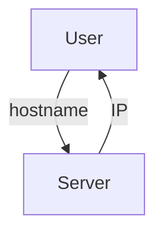
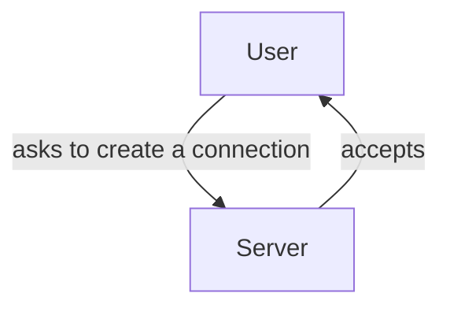

# How does the internet work?
## Formatting the message
So both client and server can understand the message that was sent, several protocols are used to express what the message is. These set of rules are known as [[TCP IP]] and the [[HTTP]] protocol.

## Finding out the address
Through [[DNS Lookup]], a computer is able to find out the IP address of a given domain name.

## Opening up a socket connection
The computer tries to create a socket connection between itself and the IP that was found.

## Sending the message

The internet works by sending and retrieving packets. To find its destination, each package that is sent has the sender address and usually has to travel several routers. When a package reaches a router, the router's address is wrapped around the package so it can find its way back after it reaches its destination.

![[Pasted image 20211213210935.png]]

---

Related: [[IP Address|IP Addresses]], [[Internet]]